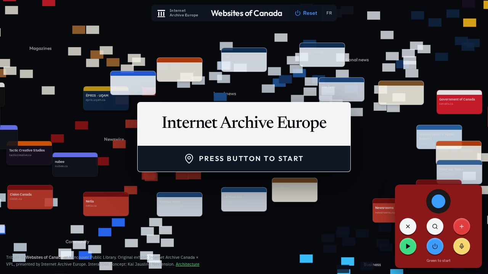
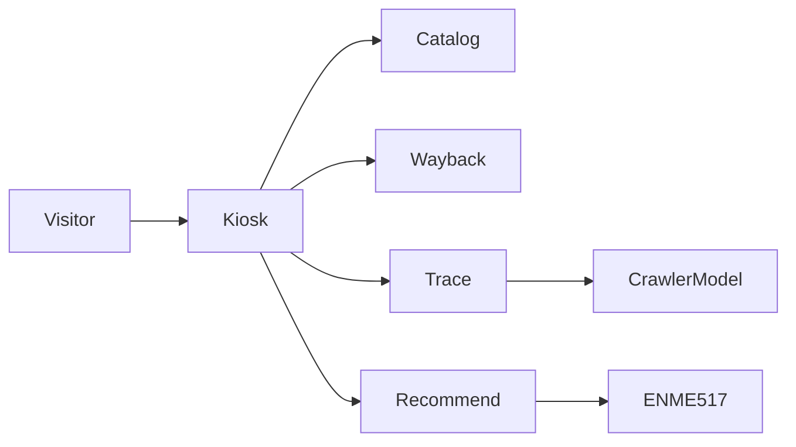
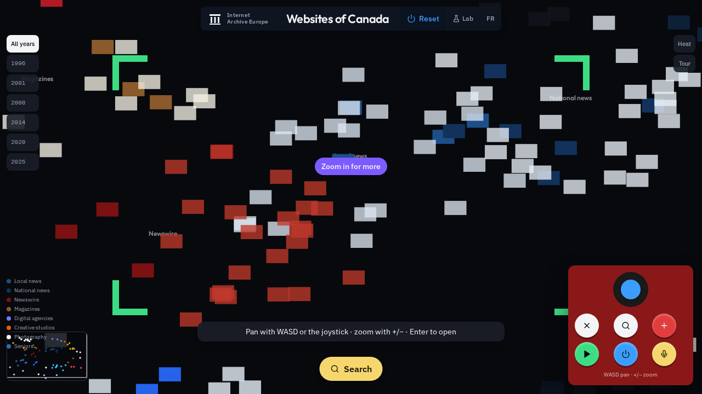
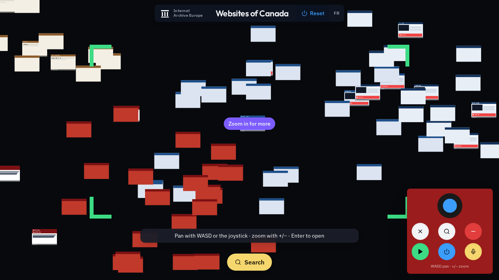
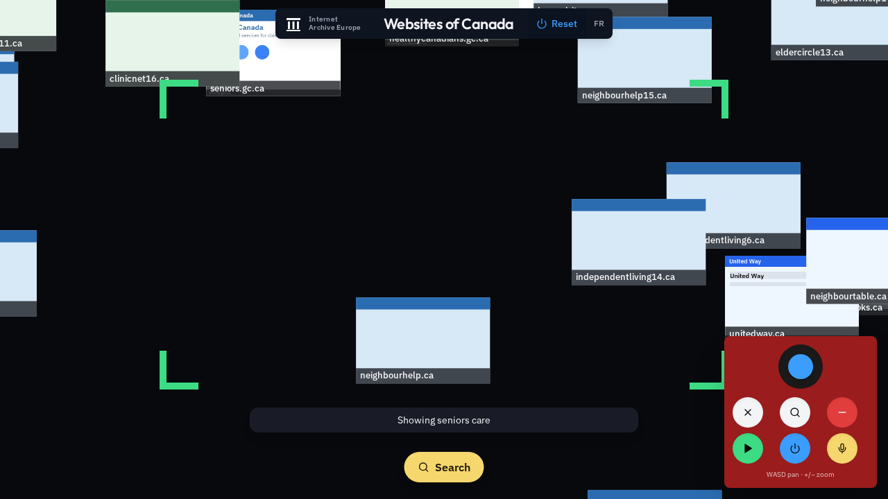
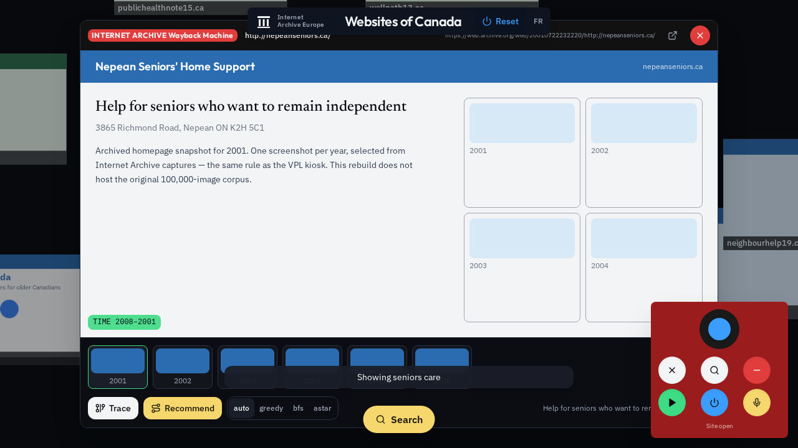
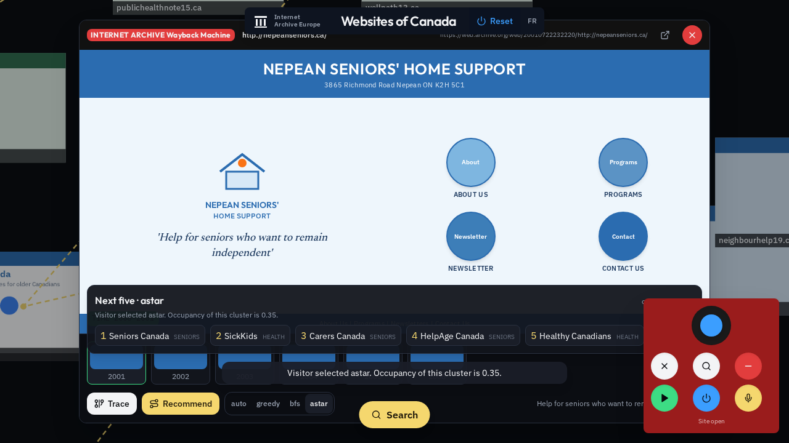

# Websites of Canada

A browser tribute to the **Websites of Canada** kiosk at Vancouver Public Library — Internet Archive Canada × VPL, presented by Internet Archive Europe. Interaction lineage: Kai Jauslin / Nextension + Swiss National Library (2021).

This is **not** an official Internet Archive product and does not host the exhibit’s 100,000 proprietary homepage screenshots.

**Live (Netlify):** [websites-of-canada.netlify.app](https://websites-of-canada.netlify.app)

## What you can do

1. Press **PRESS BUTTON TO START**.
2. Pan the semantic mosaic (WASD / drag / joystick). Similar topics sit together.
3. Zoom until a `.ca` homepage is readable (green L-viewfinder).
4. Search by text or voice: `show seniors`, `open montreal times`.
5. Open a site and scrub its Wayback years (Nepean 2001–2008, JYN 2017–2025).
6. **Trace** — category-scoped resource graph (crawler model).
7. **Recommend** — greedy / BFS / A* path through the mosaic (ENME517 occupancy rule).

## Controls

| Control | Action |
| --- | --- |
| Blue joystick / WASD / drag | Pan |
| Red + / wheel / = | Zoom in |
| − / Q | Zoom out |
| Green ▶ / Enter | Open focus site |
| Yellow mic / Space / `/` | Search |
| Esc | Close overlay |
| R / Reset | Attract screen |

## Architecture

- Catalog: `src/lib/catalog.ts` (React) / `kiosk/app.js` (static)
- Trace: `src/lib/trace.ts` — see [docs/CRAWLER_INTEGRATION.md](docs/CRAWLER_INTEGRATION.md)
- Recommend: `src/lib/policies.ts` + `recommender/policies.py` — see [docs/RECOMMENDER.md](docs/RECOMMENDER.md)
- Full architecture: [docs/ARCHITECTURE.md](docs/ARCHITECTURE.md)
- Requirements: [docs/REQUIREMENTS.md](docs/REQUIREMENTS.md)
- Rebuild prompts: [docs/BUILD_PROMPTS.md](docs/BUILD_PROMPTS.md)

### How the two sibling repos plug in

**[resource-graph-crawler](https://github.com/ahmaddroobi99/resource-graph-crawler)** is a same-host BFS (URLs = nodes, body refs = edges, `POST /api/v1/crawl` capped at ~12 pages, locked to a configured seed). The kiosk does **not** crawl 100k sites. On Trace it:

1. Builds a same-host template graph for the open `.ca` host.
2. Seeds up to four same-category neighbors.
3. Colors nodes with the mosaic taxonomy.
4. Falls back if the service is down or host-locked.

**[ENME517](https://github.com/ahmaddroobi99/ENME517)** is a shortest-path DoE, not a recsys.

| ENME517 | Kiosk |
| --- | --- |
| Grid cell | Catalog site |
| Obstacle | Already visited / no known year |
| Occupancy density | How tight that category cluster is |
| greedy / BFS / A* | Ranking policies for the next 5 sites |

Dense cluster → greedy; sparse niche → A*; cold start → BFS.

## GIF walkthrough

| Step | Preview |
| --- | --- |
| Attract |  |
| Galaxy |  |
| Zoom |  |
| Search seniors |  |
| Wayback filmstrip |  |
| Trace + recommend |  |

## Deploy

- **Netlify:** `netlify.toml` publishes `kiosk/` (static, no build).
- **Grok / Vercel:** TanStack Start app in `src/`.

## Credit

Internet Archive Canada, Internet Archive Europe, Vancouver Public Library, Kai Jauslin / Nextension, Swiss National Library. Wayback Machine captures remain on web.archive.org.
