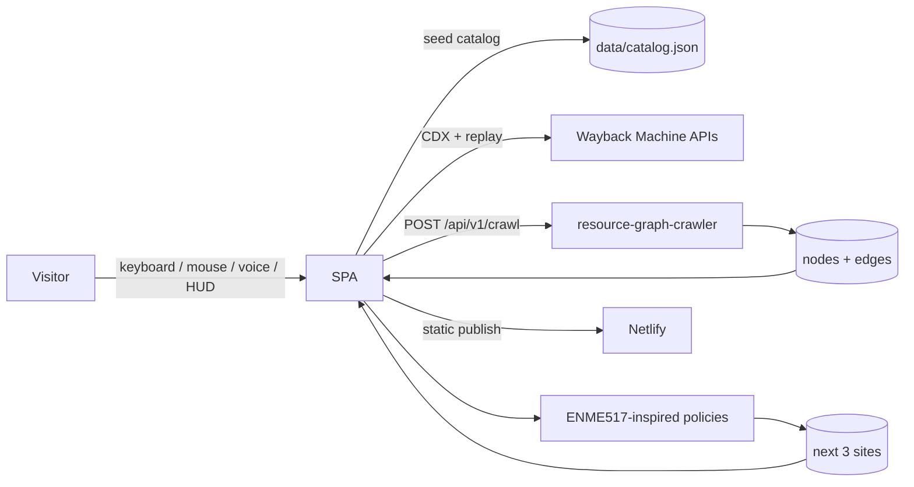
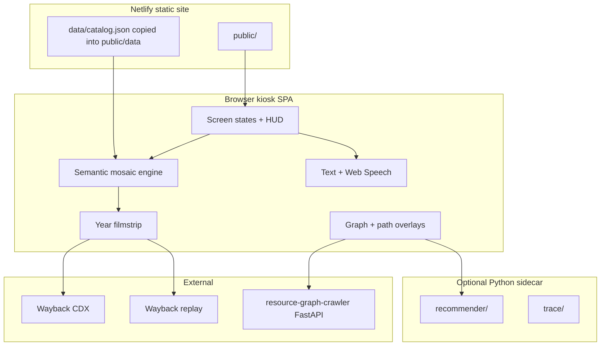
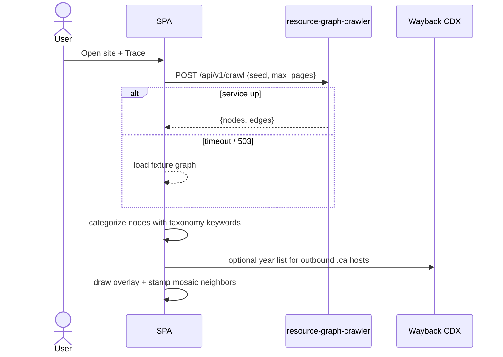
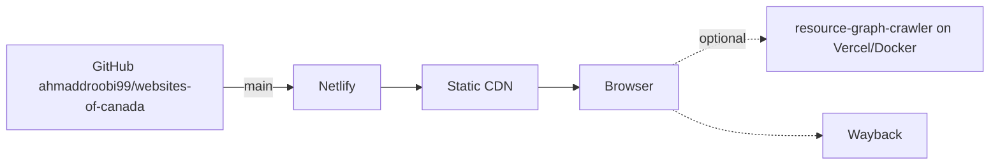

# System Architecture — Websites of Canada

Tribute rebuild of the VPL / Internet Archive Canada kiosk, plus two original subsystems: specialized resource-graph tracing and a pathfinding recommender.

---

## 1. Context



---

## 2. Container view



---

## 3. SPA modules

| Module | File | Responsibility |
|---|---|---|
| Boot / attract | `public/index.html` | Start screen, credit bar |
| Mosaic camera | `public/js/mosaic.js` | World coords, pan, zoom, viewfinder hit-test |
| Catalog | `public/js/catalog.js` | Load + index sites by host/category |
| HUD | `public/js/hud.js` | Joystick, buttons, hold-to-repeat |
| Voice | `public/js/voice.js` | Web Speech + intent parser |
| Wayback | `public/js/wayback.js` | CDX fetch, filmstrip, replay URL builder |
| Trace | `public/js/trace.js` | Crawler client + fixture fallback |
| Recommend | `public/js/recommend.js` | greedy / bfs / astar / doe |
| Render | `public/js/render.js` | Tiles, overlays, stacked year cards |

MVP may collapse these into `public/app.js` until the stepwise prompts split them.

---

## 4. Semantic grid

The physical exhibit lays screenshots on a plane with VLM + embeddings so similar topics sit together. We approximate that:

1. Assign each category a home region on the unit square.
2. Jitter each site inside its region (`x,y` in the catalog).
3. Adjacent categories share borders so a pan feels like walking a topic landscape.
4. Occupancy density of a region = `sites_in_region / region_area`. This is the ENME517 analogue of obstacle-field occupancy.

```
[indigenous | civic | education | health | seniors-care ]
[arts      | news | magazines | newswire | faith-youth ]
[photo     | creative | digital-agency | business | sports ]
[environment | community-nonprofit | …                     ]
```

---

## 5. Specialized trace pipeline



Crawler internals (already built in the sibling repo):

- `fetcher` — only network layer
- `url_utils` — host allow-list
- `frontier` — BFS + dedupe
- `discovery` — refs from HTML, scripts, CSS, comments, binaries
- `engine` — bounded parallel BFS
- `service.app` — FastAPI facade

Public API is capped (~12 pages). Full traces use Docker/CLI.

---

## 6. Recommender pipeline

Treat the mosaic as a graph:

- Node = catalog site
- Edge weight = semantic distance + category mismatch penalty + year-gap penalty
- Occupancy = local density
- Obstacle analogue = missing Wayback snapshot or already-visited site

```
policy_greedy   : argmin distance(current, unused_neighbor)
policy_bfs      : expand by degree / inbound refs from traces
policy_astar    : f = g(path) + h(semantic, year, diversity)
policy_doe      : assign policy at session start; log sites_opened
```

Switch rule (from ENME517 “when does A* lose its advantage?”):

```
if occupancy(cluster) >= θ_high: use greedy
elif occupancy(cluster) <= θ_low:  use astar
else:                             use bfs
```

Default thresholds: `θ_high = 0.65`, `θ_low = 0.25`.

---

## 7. Deploy architecture



- Frontend: static files in `public/`.
- No Netlify Functions required for MVP.
- Crawler remains its own service. Do not fold a 2,000-page BFS into a serverless page render.

---

## 8. Threats / limits

- Wayback CDX can be slow or rate-limited. Cache in `sessionStorage` keyed by host.
- Iframe replay may be blocked by `X-Frame-Options`. Always offer “Open in Wayback”.
- Speech recognition needs HTTPS + mic permission.
- Crawler must stay host-scoped. Never send a wildcard `*.ca` crawl from the kiosk.
- Screenshot corpus of 100k pages is not ours. Seed + placeholders only.

---

## 9. Credit surface (always visible)

Footer or attract screen must include:

> Tribute to *Websites of Canada* at Vancouver Public Library.  
> Original exhibit: Internet Archive Canada × VPL, presented by Internet Archive Europe.  
> Interaction concept: Kai Jauslin / Nextension + Swiss National Library.  
> Not an official Internet Archive product.
