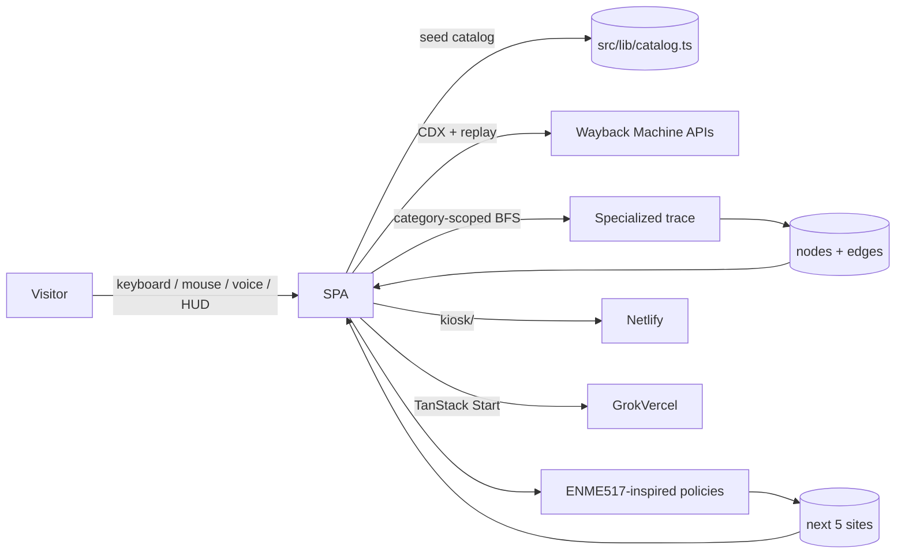

# System Architecture — Websites of Canada

Tribute rebuild of the VPL / Internet Archive Canada kiosk, plus specialized resource-graph tracing and a pathfinding recommender.

## Context



## Semantic grid

The physical exhibit uses VLM embeddings so similar homepages sit together. We approximate that with category home regions + jitter. Occupancy of a region = `sites / bbox_area` — the ENME517 analogue of obstacle-field occupancy.

## Specialized trace

The public crawler API is locked to a configured seed (`POST /api/v1/crawl` body is `{max_pages, workers}`). The kiosk therefore:

1. Builds a same-host template graph for the focused `.ca` host.
2. Seeds up to four same-category mosaic neighbors.
3. Colors nodes with the mosaic taxonomy.
4. Optionally pings the crawler; always keeps the local overlay.

See `docs/CRAWLER_INTEGRATION.md`.

## Recommender

```
if occupancy >= 0.65: greedy
elif occupancy <= 0.25: A*
else: BFS
```

See `docs/RECOMMENDER.md` and `src/lib/policies.ts`.

## Deploy

- **Grok / Vercel:** TanStack Start app (`npm run dev` on the preview; production via the app builder).
- **Netlify:** static `kiosk/` (`netlify.toml` publish = kiosk). Site id `websites-of-canada`.
- Crawler remains its own service. Do not fold a 2,000-page BFS into a page render.

## Credit

Tribute to *Websites of Canada* at VPL. Original: Internet Archive Canada × VPL, presented by Internet Archive Europe. Interaction: Kai Jauslin / Nextension + Swiss National Library. Not an official Internet Archive product.
